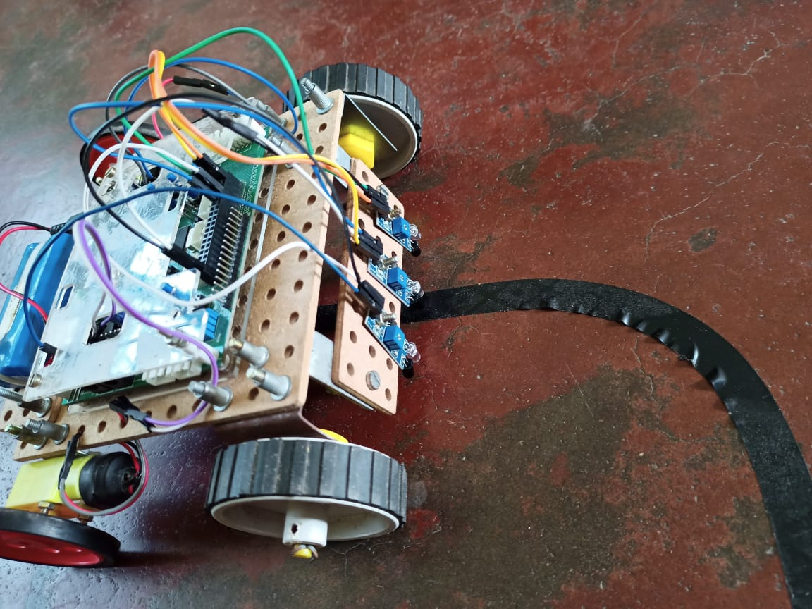
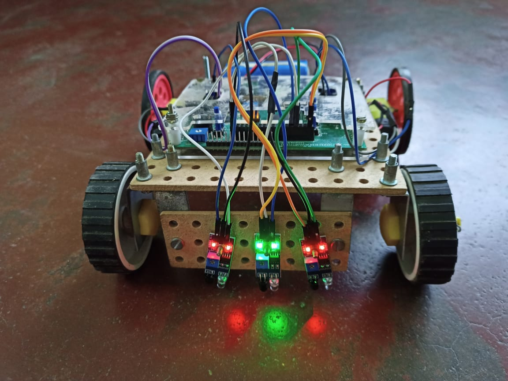
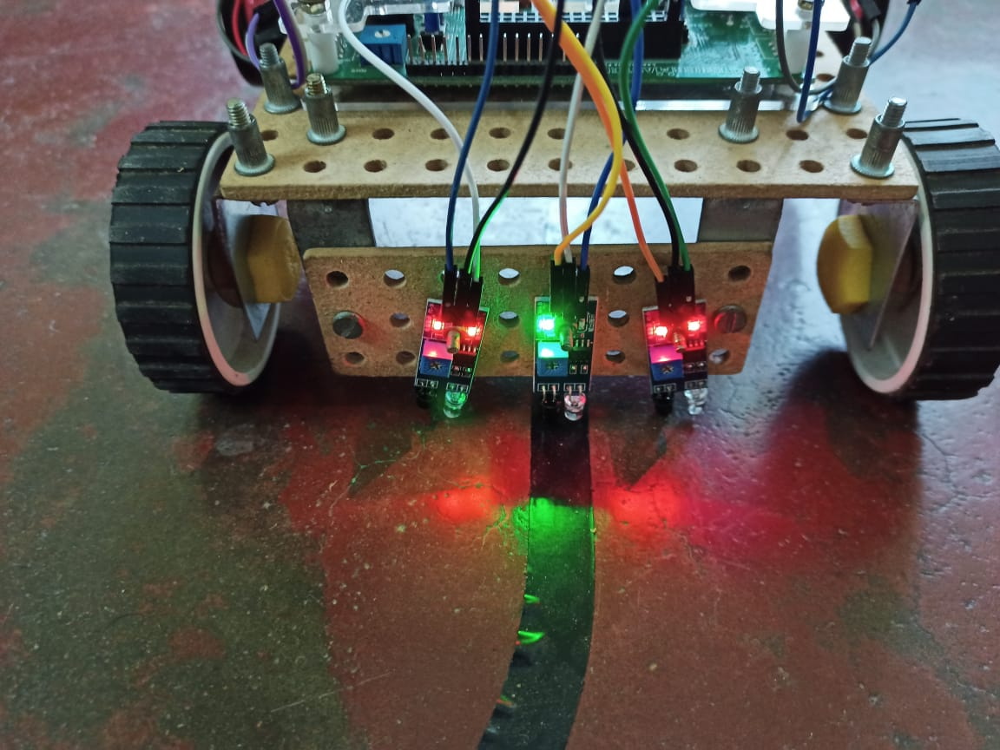

It's a simple build. The purpose was to test the body of the robot for an upcoming bigger project.

## BOM

|MCU    | Arduino mega 2560  |
|-------|--------------------|
|Battery| 7.4 V, 2s Li-ion   |
|Motor  | 400RPM Gear motor  |
|Sensors| IR Proximity sensor|

## Some images

